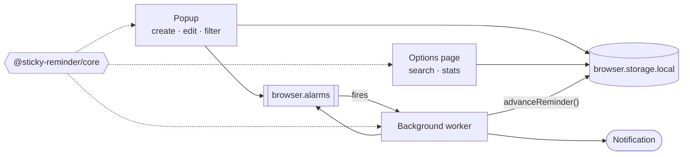

<div align="center">


<p>
  <a href="https://github.com/Andersseen/sticky-reminder/actions/workflows/ci.yml"></a>
  <a href="https://github.com/Andersseen/sticky-reminder/actions/workflows/deploy-web.yml"></a>
  <a href="https://github.com/Andersseen/sticky-reminder/releases/latest"></a>
  <a href="LICENSE"></a>
  
</p>

<p>
  <b><a href="https://andersseen.github.io/sticky-reminder/">Website</a></b> ·
  <b><a href="https://andersseen.github.io/sticky-reminder/download">Install</a></b> ·
  <b><a href="https://github.com/Andersseen/sticky-reminder/releases/latest">Releases</a></b> ·
  <b><a href="CONTRIBUTING.md">Contributing</a></b>
</p>

</div>

**Sticky Reminder** is a browser extension for reminders that reach you: write one in
a click, get a native notification when it is due, and repeat it daily or weekly if
it should come back. Every reminder is stored on your own device — no account, no
server, no network requests at all.

The repo is a pnpm + Turborepo monorepo holding the extension, its website, and the
two packages both are built from.

---

## Screenshots

<table>
<tr>
<td width="50%"></td>
<td width="50%"></td>
</tr>
<tr>
<td colspan="2"></td>
</tr>
</table>

## What it does

| | |
|---|---|
| **One-click capture** | The popup opens on the form. Title, optional note, a time — or a shortcut: in an hour, this evening, tomorrow at nine. |
| **Native notifications** | Reminders fire through the browser's own notification system, so they arrive whether or not the tab that created them still exists. |
| **Daily and weekly repeats** | A repeating reminder rolls forward the moment it fires, and skips the periods it slept through instead of firing a backlog. |
| **Overdue at a glance** | Late reminders turn red and say how late. Search, filter and counters live on the options page. |
| **Local only** | `alarms`, `notifications` and `storage`. No host permissions, so the extension cannot read a single page you visit. |

## Install

Grab the build for your browser from the [latest release](https://github.com/Andersseen/sticky-reminder/releases/latest):

- **Chrome / Edge / Brave / Arc** — unzip `sticky-reminder-*-chrome.zip`, open `chrome://extensions`, turn on Developer mode, then **Load unpacked**.
- **Firefox** — open `about:debugging#/runtime/this-firefox` and **Load Temporary Add-on** with `sticky-reminder-*-firefox.zip`.

The [download page](https://andersseen.github.io/sticky-reminder/download) walks
through both, and every release also carries the packed `@sticky-reminder/core`
and `@sticky-reminder/ui` tarballs.

## Repository layout

```
sticky-reminder/
├── apps/
│   ├── extension/   # The extension — WXT, popup, options page, background worker
│   └── web/         # The site — Astro, deployed to GitHub Pages
└── packages/
    ├── core/        # Reminder logic: pure TypeScript, no browser APIs
    └── ui/          # The two app-specific Web Components (Lit) + shared stylesheet
```

The split is enforced by one rule in each direction: `packages/core` never touches
a browser API — scheduling maths is unit-tested without a browser — and anything
that does touch `browser.alarms` or `browser.storage` lives in
`apps/extension/utils`.



## Getting started

```bash
pnpm install
pnpm build          # the extension tests import core from its build output
pnpm dev            # extension (WXT) + site (Astro) dev servers
```

| Script | What it does |
|--------|--------------|
| `pnpm dev` | Start every dev server |
| `pnpm build` | Build every workspace |
| `pnpm lint` | Typecheck and lint with Biome |
| `pnpm test` | Unit tests (Vitest) |
| `pnpm test:e2e` | Site E2E (Playwright) |
| `pnpm clean` | Remove build artifacts |

Extension-only:

```bash
cd apps/extension
pnpm dev             # WXT dev server with hot reload
pnpm zip             # sticky-reminder-<version>-chrome.zip in .output/
pnpm zip:firefox     # the Firefox build
pnpm test:e2e        # loads the unpacked build into a real Chromium
```

## Design system

The UI is built on the Andersseen packages rather than hand-rolled primitives:

| Package | Role |
|---------|------|
| `@andersseen/web-components` | `and-button`, `and-input`, `and-select`, `and-card`, `and-badge`, `and-icon`… |
| `@andersseen/layout` | Attribute-driven layout: `and-layout="vertical gap:md"` |
| `@andersseen/icon` | Tree-shaken icon registry — see `registerStickyIcons()` |
| `@andersseen/motion` | `and-motion="fade-in"`, scanned by `MotionController` |

`packages/ui` holds only what is specific to this app (`sr-reminder-form`,
`sr-reminder-item`, `sr-empty-state`). Four constraints are worth knowing before
touching the UI:

- **Shadow roots are the boundary.** `@andersseen/layout` and `@andersseen/motion`
  are global stylesheet rules, so they work in page markup but not inside a Lit
  shadow root. Components style themselves from the design tokens instead.
- **Some components style their own host.** `and-card` renders as
  `rounded-lg border bg-card p-4` on the custom element itself, and a component
  cannot style its own host that way — those classes come from
  `@andersseen/web-components/elements.css`. Without it, cards render as bare,
  unpadded blocks. It is imported once, by `@sticky-reminder/ui/styles`, together
  with `tokens.css`.
- **The same applies one level down.** A library component used *inside* another
  component's shadow root (`and-badge` inside `sr-reminder-item`) is out of reach
  of that stylesheet too, and is restyled from the tokens in the component itself.
- **Motion is for static chrome.** `and-motion` reveals are scroll-triggered, so a
  list row rendered below the fold would sit at opacity 0 until something scrolled
  it into view. Lists render without it.

## Testing

- **Unit** — Vitest across `packages/*` and `apps/*`. Run `pnpm build` first: the
  extension tests import `@sticky-reminder/core` from its build output.
- **E2E** — `pnpm test:e2e` starts the Astro site and drives it. The extension
  suite (`cd apps/extension && pnpm test:e2e`) loads the unpacked build into a
  real Chromium and exercises alarms, storage and notifications.

## Automation

| Workflow | Trigger | What it does |
|----------|---------|--------------|
| [`ci.yml`](.github/workflows/ci.yml) | push and PR to `main` | Lint, unit tests, both browser builds, then both E2E suites |
| [`deploy-web.yml`](.github/workflows/deploy-web.yml) | push to `main` touching the site | Builds the site with the Pages base path and publishes it — visible under **Deployments** |
| [`release.yml`](.github/workflows/release.yml) | a `v*` tag | Zips the Chrome and Firefox builds, packs both libraries, and publishes a GitHub Release with them attached |

Cutting a release:

```bash
git tag v1.1.0 && git push origin v1.1.0
```

## License

[MIT](LICENSE) © Andersseen
